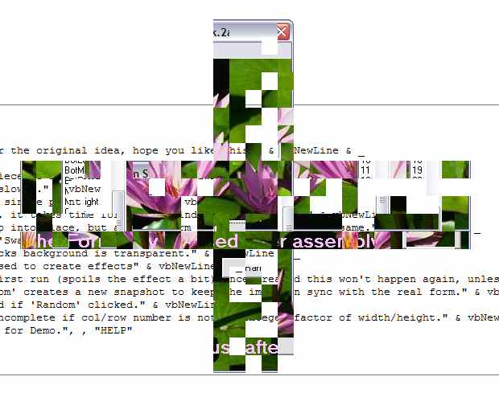



## Another Assemble a Form on start\-up \(Update 1\)

### Description

This is a modification/rewrite of Chris Seelbach's 'A$$emble a Form on start-up' <txtCodeId=57585>.

I have used a suggestion of Luke H in his comment on 'Dr. Fire Transparent Control' <txtCodeId=50160> to make the effect more impressive if you use XP. (it will run in earlier versions but lacks transparency).

I have also modified the code 'Capture Active Window The Inventive Way (without API calls)'<txtCodeId=33946> to allow the my code to capture a live image of the form it is pretending to assemble.

A couple of new Start and Build modes and better comments.

----

Updated: Thanks to Raul Fragoso's 'Verify if a point is inside a polygon (convex and non-convex)' <txtCodeId=32682> I have now included a version of Chris's original wedge drawing.
 
### More Info
 

             |
---                |---
**Submitted On**   |2004-12-14 23:05:54
**By**             |[Roger Gilchrist](https://github.com/Planet-Source-Code/PSCIndex/blob/master/ByAuthor/roger-gilchrist.md)
**Level**          |Intermediate
**User Rating**    |5.0 (40 globes from 8 users)
**Compatibility**  |VB 6\.0
**Category**       |[Graphics](https://github.com/Planet-Source-Code/PSCIndex/blob/master/ByCategory/graphics__1-46.md)
**World**          |[Visual Basic](https://github.com/Planet-Source-Code/PSCIndex/blob/master/ByWorld/visual-basic.md)
**Archive File**   |[Another\_As18294412142004\.zip](https://github.com/Planet-Source-Code/roger-gilchrist-another-assemble-a-form-on-start-up-update-1__1-57711/archive/master.zip)

